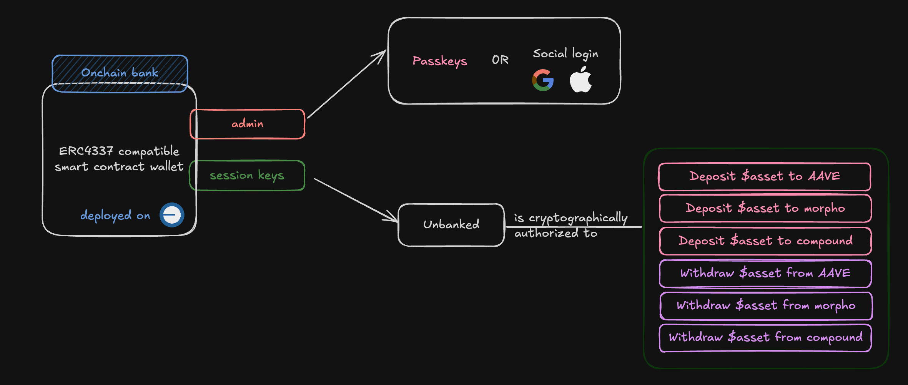

# Unbanked

Going bankless has never been this fun! Unbanked.fun is an ERC4337 wallet designed with UX in mind, helping users stack their dollars and constantly move their liquidity to reward them with the best yield on the market, all while remaining fully non-custodial. All of that while abstracting the gas for the end user.

# Concept

# How does it work?

When onboarding the user, we create an ERC4337 on Base for him. User is, and will always be, the only controller of the smart
contract account through the method he chooses (EOA, social logins, passkey, ...). Once he tops up its account with a stablecoin (USDC), we then automatically move its liquidity accros multiple money markets (currently AAVE and IONIC are supported). Our systems actively monitor the current stablecoin lending rates to ensure the liquidity is always in the best rewarding pools.

When the user starts his journey on the dapp, we ask him to authorize a few things (this is transparent for all the users except ones with an EOA admin):
1. We deploy an ERC4337
2. We create a session key that autorizes Unbanked to do 4 very specific actions:
    a. Deposit and Withdraw USDC from AAVE
    b. Deposit and Withdraw USDC from IONIC
3. We create an automation that will last forever: the liquidity rebalancing. Once the user deposits some capital, the automation will be in charge of moving it accross the supported money markets.

All the experience is gasless for the user! We sponsor it using ERC4337 capacibilities. Moreover, leveraging this smart contract wallet standard gives
many advantages, such as the user doesn't need to deposit any fund in a vault or in custom contracts (Which means we don't add big security risks on top of the additional money market risks). The proof of deposits from money market always stay in his wallet. 

# How it's made

I used Thirdweb's ERC4337 implementation. I used their library for the UI connect component as well. It is deployed on Base for every users.
I used [Otomato](https://otomato.xyz) for the automation. I especially leverage their [SDK](https://github.com/Otomatorg/otomato-sdk) for the automation 
creation, as well as the gas sponsorship for the users.
In order to give some delegation power to Otomato (i.e to run some specific transactions on the behalf of users), I used session keys, which are a core feature of the ERC4337 contract. It enables users to allow some signer to interact with very specific contracts, and only those.
I would have loved to integrate call policies as well (to go even deeper in the permission system), but I didn't have the time.

# To go further

- Supporting more money market (obviously).
- actively borrowing and repaying: if it's worth borrowing any asset against our collateral, and deposit it on another one,
we can actively do it, while monitoring the evolution of the rates (and, obviously, the LTV).
- hysteresys threshold: implement a better mechanism to avoid round trips between protocols, especially if we start to have a size big enough to impact protocol rates.

**The future is on-chain.**